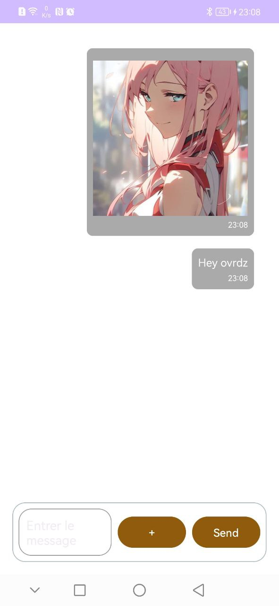
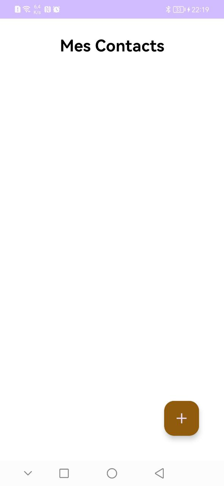
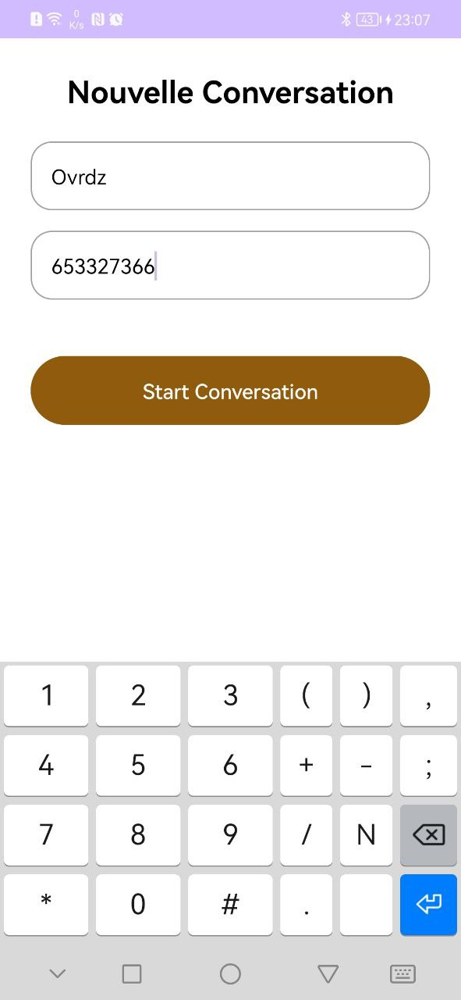

# Tam-Tam 

Tam Tam est une application de messagerie hors ligne développée en Kotlin par les etudiants de Ict-L2

  

## Comment ca marche ?    
`ajouter un contact`
  
  `entrer les informations de votre contact`
  



## Details sur le code

Description générale :
Tam Tam est une application de messagerie hors ligne développée en Kotlin. Elle utilise Nearby Connection de Google pour permettre aux utilisateurs d'envoyer et recevoir des messages texte et des images sans connexion Internet. L'application fonctionne de manière décentralisée avec une stratégie de cluster.

## Fonctionnalités principales :

### 1. Découverte et publicité des appareils :
   - Utilise `Nearby.getConnectionsClient` pour trouver et se connecter aux appareils à proximité.
   - Utilise la stratégie `P2P_CLUSTER` pour les connexions.
   - Lorsqu'un appareil est trouvé, l'application tente automatiquement de se connecter.

### 2. Envoi et réception de messages :
   - Les messages peuvent être envoyés à des destinataires spécifiques ou diffusés à tous les appareils connectés.
   - Les messages sont stockés dans une base de données locale.
   - Chaque message contient l'expéditeur, le destinataire, le contenu, l'horodatage, une liste de relais et éventuellement un URI d'image.
   - Les messages non envoyés en raison d'un manque total de réseau sont supprimés.
   - Lorsqu'un message est reçu d'un numéro non enregistré, il est enregistré sous le nom "Inconnu".
   - Un message ne peut être relayé plus de 10 fois et ne peut pas être envoyé plusieurs fois au même appareil.

### 3. Gestion des connexions :
   - Lorsqu'un appareil se connecte à un autre appareil, il envoie tous les messages non destinés à lui-même.
   - Les tentatives de connexion et d'envoi de fichiers sont réessayées jusqu'à trois fois en cas d'échec.

### 4. Envoi d'images :
   - Les images peuvent être envoyées sous forme de fichier.
   - Un message de nom de fichier est envoyé avant l'image pour identifier l'image reçue.
   - Utilisation de Picasso pour charger et afficher les images dans l'interface utilisateur.

### 5. Rootage des messages : 
   - Un message dont le destinataire n’est pas disponible ( à portée de connexion ) sera envoyé à tous les appareils connectés.

### 6. Affichage des messages :
   - Les messages sont affichés dans un `RecyclerView`.
   - Les messages envoyés et reçus ont des mises en page différentes.
   - Les messages avec des images affichent l'image, tandis que les messages texte affichent le texte du message.

### 7. Gestion des contacts :
   - Les contacts peuvent être renommés avec un appui long.
   - Les messages d'un numéro non enregistré sont sauvegardés sous "Inconnu".

## Limites et manques :
- Pas de messagerie de groupe.
- Les écrans ne se rafraîchissent pas automatiquement lorsque les listes sont mises à jour.
- Le rebond des messages avec des images est très compliqué.
- Les utilisateurs ne peuvent pas changer leur propre numéro.
- La fonction de décryptage crée des erreurs, donc le cryptage a été mis de côté pour le moment.
- Lors de la première ouverture de l'application, après avoir entré le numéro, il faut relancer l'application (parfois même après avoir enregistré le premier contact, cela dépend des téléphones).
- Certains téléphones ne demandent pas toutes les permissions, ce qui perturbe l'envoi de messages.

# Exemples de code :

## Envoi d'un message :
```
fun sendMessageToEndpoint(endpointId: String, message: Message, deviceNumber: String) {
    CoroutineScope(Dispatchers.Main).launch {
        val endpoint = discoveredEndpoints.find { it.id == endpointId }
        if (endpoint != null && endpoint.available) {
            sendPayloadWithRetry(endpointId, Payload.fromBytes(serializeMessage(message)), deviceNumber, 3)
        } else {
            Log.e(TAG, "Endpoint $endpointId not available")
        }
    }
}
```

## Réception d'un message :
```---------------------code------------------------------
private val payloadCallback = object : PayloadCallback() {
    override fun onPayloadReceived(endpointId: String, payload: Payload) {
        if (payload.type == Payload.Type.BYTES) {
            val receivedBytes = payload.asBytes()!!
            val message = deserializeMessage(receivedBytes)
            handleMessage(message)
        }
    }

    override fun onPayloadTransferUpdate(endpointId: String, update: PayloadTransferUpdate) {
        // Handle updates if needed
    }
}

private fun handleMessage(message: Message) {
    CoroutineScope(Dispatchers.Main).launch {
        DatabaseHelper.saveMessage(message, currentUserPhoneNumber)
        if (message.recipient == currentUserPhoneNumber) {
            Log.d(TAG, "Message received: ${message.content}")
            val contact = DatabaseHelper.getContact(message.sender)
            if (contact == null) {
                DatabaseHelper.saveContact(message.sender, "Inconnu")
            }
        } else {
            if (message.relays.size < 10) {
                message.relays.add(currentUserPhoneNumber)
                sendMessageToAllEndpoints(message, currentUserPhoneNumber)
            } else {
                Log.d(TAG, "Message relay limit reached")
            }
        }
    }
}
```

## Envoi de message à tous les appareils connectés :
```---------------------code------------------------------
private fun sendMessageToAllEndpoints(message: Message, currentUserPhoneNumber: String) {
    for (endpoint in discoveredEndpoints) {
        if (endpoint.id != currentUserPhoneNumber && !message.relays.contains(endpoint.id)) {
            sendMessageToEndpoint(endpoint.id, message, currentUserPhoneNumber)
        }
    }
}
```

## Affichage d'un message avec image :
```---------------------code------------------------------
class SentMessageViewHolder(itemView: View) : RecyclerView.ViewHolder(itemView) {
    private val messageTextView: TextView = itemView.findViewById(R.id.text_message_body)
    private val messageTimeTextView: TextView = itemView.findViewById(R.id.text_message_time)
    private val messageImageView: ImageView = itemView.findViewById(R.id.image_message_body)

    fun bind(message: Message) {
        if (message.imageUri != null) {
            messageTextView.visibility = View.GONE
            messageImageView.visibility = View.VISIBLE
            Picasso.get().load(Uri.parse(message.imageUri.toString())).into(messageImageView)
        } else {
            messageTextView.visibility = View.VISIBLE
            messageImageView.visibility = View.GONE
            messageTextView.text = message.content
        }
        messageTimeTextView.text = formatDate(message.timestamp)
    }
}
```

# Conclusion :
Tam Tam est une application pratique pour la messagerie hors ligne, permettant d'envoyer des messages texte et des images sans Internet. Elle gère bien les connexions et les transferts de messages. Cependant, elle a encore des limites et des défis à relever pour améliorer l'expérience utilisateur.
